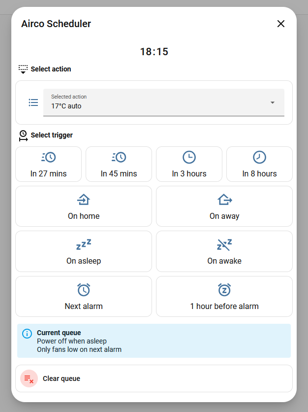

<p align="center">
  
</p>

# Scheduled Action

<p align="left">
  <a href="https://hacs.xyz/">
    
  </a>
  <a href="https://github.com/Kizerbyte/ha-scheduled-action/releases">
    
  </a>
</p>


A custom component for a delayed or scheduled action, **able to trigger anything** that can be pressed, toggled, or turned on/off!
Annoyed by an automation that fires **only** on a regular schedule or trigger? Look no further as this is for the occasional or irregular scheduled actions!

<q>I only want my coffee to brew when I've actually put a cup under it and plan on it</q>

<q>My airco should turn on an hour before I wake up, but only for this hot night</q>


You can spawn an integration entry that holds its own triggers and actions, so have as many as you like.

## Features
- Queue an action for later
  - Trigger actions when you get home or leave
  - Trigger actions when you fall asleep or wake up
  - React to custom events
  - Clear queue
- Popup-based scheduling UI through [Browser Mod](https://github.com/thomasloven/hass-browser_mod)
  - Front-end flexibility, requiring only a fire-dom-event call!
- Infinitely many different configurations, referenced by 'entry_id'!
  - Hide unwanted triggers from the popup

-->[CODE EXAMPLES](#code-examples)<--



### Notes

- Browser Mod is optional, but recommended if you want the popup flow.
- The popup flow is designed so the backend owns the popup context and scheduler logic.

---

## Installation

### HACS (Custom Repository)

1. Open **HACS**.
2. Go to **⋮ → Custom repositories**.
3. Add repository:
   - **Repository**: `https://github.com/Kizerbyte/ha-scheduled-action`
   - **Category**: `Integration`
4. Search for **Scheduled Action**.
5. Install it.
6. Restart Home Assistant.

### Manual

1. Copy `custom_components/scheduled_action` into your Home Assistant `custom_components` directory.
2. Restart Home Assistant.
3. Go to **Settings → Devices & Services → Add Integration**.
4. Search for **Scheduled Action**.

Expected folder structure:

```text
config/
└── custom_components/
    └── scheduled_action/
        ├── __init__.py
        ├── manifest.json
        ├── ...
```

## Configuration

This integration is configured through the Home Assistant UI.

During setup you can configure:
- scheduler name
- timed triggers
- optional home-state entity
- optional sleep-state entity
- optional custom events

After setup, the options flow lets you:
- add actions
- edit actions
- remove actions
- edit triggers
- enable/disable each trigger

## How it works

A scheduler entry contains:
- one or more predefined actions
- a set of timed triggers
- optional state triggers
- optional custom event triggers

When something is scheduled, it is added to the queue.
The integration then exposes queue state through entities and executes the action when its trigger condition is met.

### Example use cases

- Turn something off in 30 minutes
- Queue an IR button press for later
- Trigger an action when arriving home
- Trigger an action when going to sleep
- Trigger an action from a custom event such as `next_alarm`

## Entities

Depending on your scheduler configuration, the integration exposes entities such as:

- **Button**: clear queue
- **Binary sensor**: whether items are pending
- **Sensor**: queue count (+ metadata)
- **Sensor**: queue (+ markdown text)
- **Sensor**: next action


## Services

Main services exposed by the integration:

- `scheduled_action.open_popup`
- `scheduled_action.get_popup_context`
- `scheduled_action.schedule`
- `scheduled_action.cancel`
- `scheduled_action.cancel_all`
- `scheduled_action.fire_event`

See also:
- `custom_components/scheduled_action/services.yaml`

## Code examples

### Popup call

This integration can open a Browser Mod popup through the integration-owned service:

- `scheduled_action.open_popup`

Recommended Lovelace pattern:

```yaml
tap_action:
  action: fire-dom-event
  browser_mod:
    service: scheduled_action.open_popup
    data:
      entry_id: <ENTRY_ID>
      browser_id: THIS
```

Why this pattern:
- Browser Mod resolves `browser_id: THIS` correctly in the `fire-dom-event` path.
- The integration handles popup content generation itself, so the dashboard YAML stays small.

### Fire a custom event from an automation

Use the integration service instead of firing the internal event bus event directly.

```yaml
alias: Alarm -> scheduled action event
triggers:
  - trigger: state
    entity_id:
      - event.sleep_as_android_alarm_clock
    attribute: event_type
    to: before_smart_period
    not_from: unavailable
actions:
  - action: scheduled_action.fire_event
    data:
      entry_id: <ENTRY_ID>
      event_name: 1h_before_alarm
```

Notes:
- Prefer `scheduled_action.fire_event` over firing the internal event directly.
- Include `entry_id` if you have more than one scheduler instance.
- If no queued item is waiting for that `event_name`, nothing happens; this is a safe no-op.

### Schedule an action
#### Time based
```yaml
action: scheduled_action.schedule
data:
  entry_id: <ENTRY_ID>
  target_entity_id: <ENTITY_ID>
  action: <turn_off/turn_on/press/toggle>
  trigger:
    type: delay
    hours: 0.5
```
#### Event based
```yaml
action: scheduled_action.schedule
    data:
      entry_id: <ENTRY_ID>
      target_entity_id: <ENTITY_ID>
      action: <turn_off/turn_on/press/toggle>
      trigger:
        type: event
        event_name: 1h_before_alarm
```
You can replace
```yaml
target_entity_id: <ENTITY_ID>
action: <turn_off/turn_on/press/toggle>
```
with
```yaml
action_id: ACTION_ID
```
### Cancel one queued item

```yaml
action: scheduled_action.cancel
data:
  entry_id: <ENTRY_ID>
  item_id: <ITEM_ID>
```

### Clear all queued items

```yaml
action: scheduled_action.cancel_all
data:
  entry_id: <ENTRY_ID>
```

## License

See `LICENSE`.
